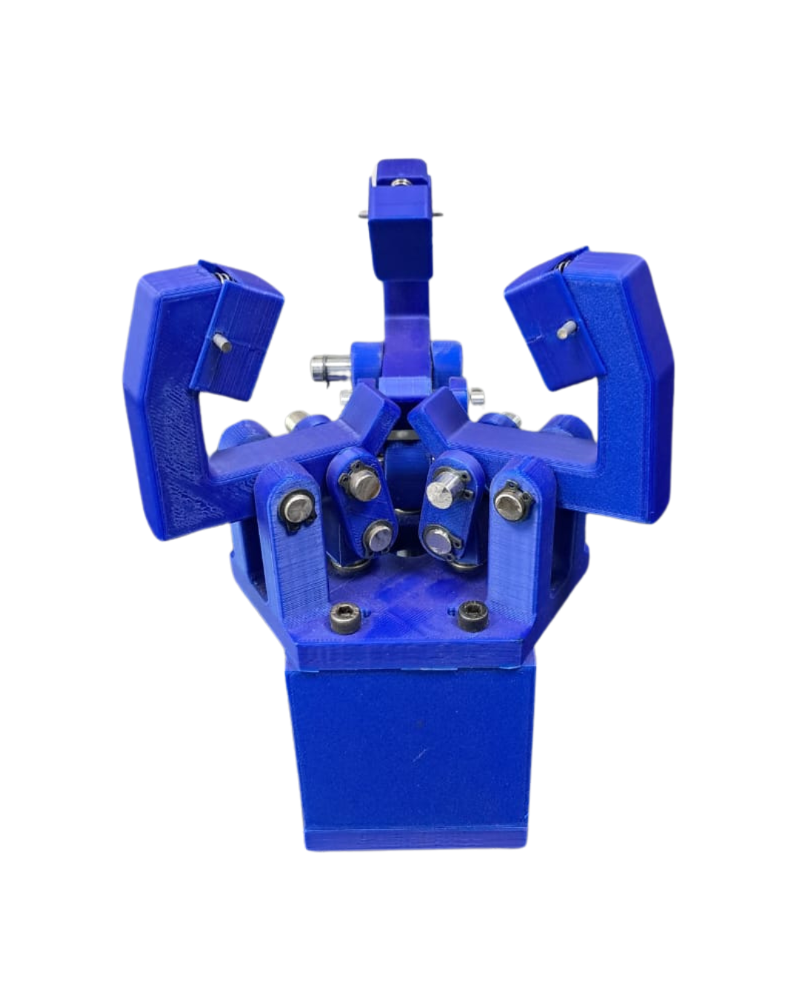
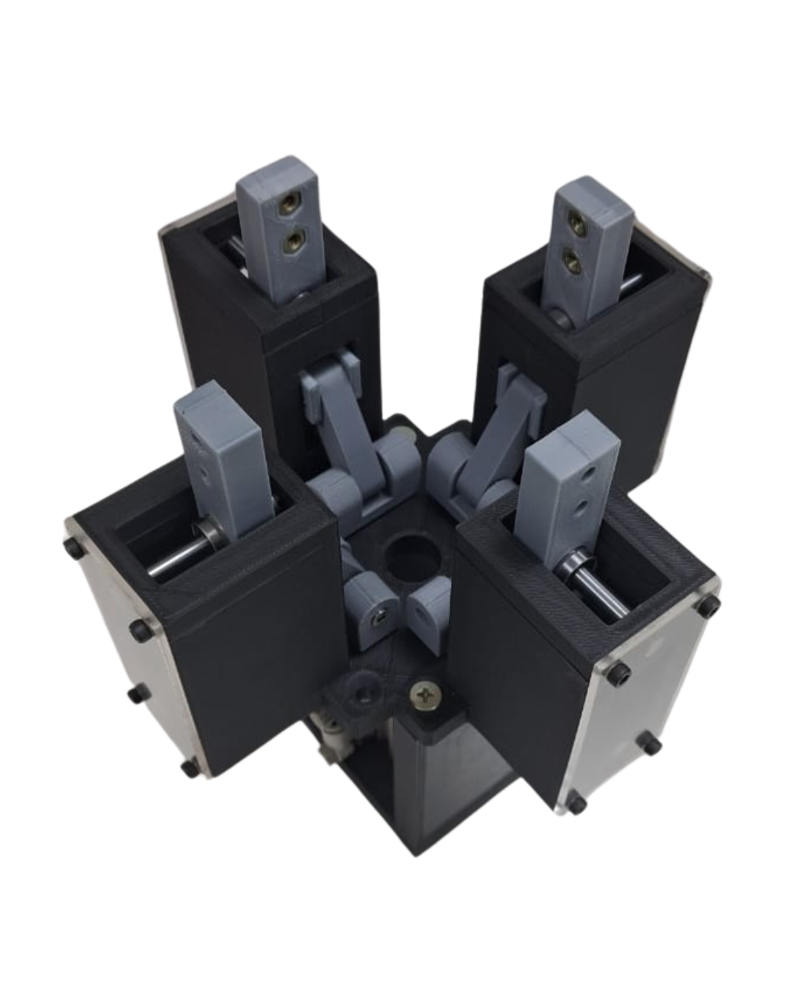
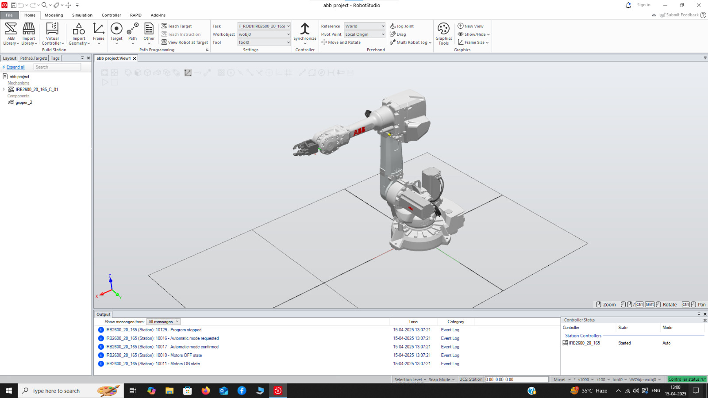
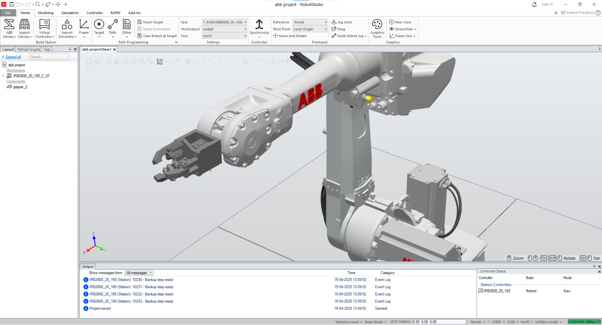
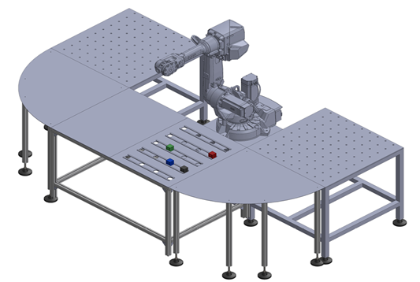

# Multi-Function Pneumatic Controlled 3D-Printed Gripper

## Demo Video

## Gripper Images

  

  
  
  

  

  
## RobotStudio

  
  

## Robot Setup

  

## Project Overview

This repository contains the design files, analysis data, and implementation details for a versatile, multi-function pneumatic gripper designed for industrial automation and robotics applications. The gripper has been engineered to operate in two distinct modes:

1. **Power Grip Mode** - For externally holding objects
2. **Precision Grip Mode** - For internally holding objects

The adaptable configuration allows for handling objects of various sizes and shapes, making it suitable for a wide range of industrial applications.

## Key Features

- Dual operational modes (power grip and precision grip)
- Pneumatic actuation using double-acting cylinder
- Solenoid valve (5/2) control system
- Adjustable pressure control
- Fully 3D-printable main components
- Modular design for easy maintenance and customization
- FEA-validated structural integrity
- Successfully simulated in Gazebo and RobotStudio environments

## Technical Specifications

- **Material**: PLA (Polylactic Acid)
- **Manufacturing Method**: Fused Deposition Modeling (FDM)
- **3D Printer Used**: Elegoo Neptune 4
- **Actuation**: Double-acting pneumatic cylinder
- **Control**: 5/2 solenoid valve
- **Design Software**: SolidWorks
- **Analysis Software**: Fusion 360
- **Simulation Environment**: ABB RobotStudio, Gazebo
- **Robot Integration**: Tested with ABB IRB2600 industrial robot
- **Load Capacity**:
  - Recommended: 1 kg
  - Maximum (tested): 20 kg

## Getting Started

### Prerequisites

- 3D printer (Tested on Elegoo Neptune 4)
- PLA filament
- Pneumatic components as listed in the BOM
- Basic tools for assembly

### Printing Instructions

1. Download the STL files from the `CAD/` directory
2. Use your preferred slicing software with the following recommended settings:
   - Layer Height: 0.2mm
   - Infill: 30-50% (depending on expected load)
   - Support: Required for overhangs
   - Material: PLA

## Applications

This gripper is suitable for:

- Pick and place operations
- Assembly tasks
- Material handling
- Machine tending
- Research and educational purposes
